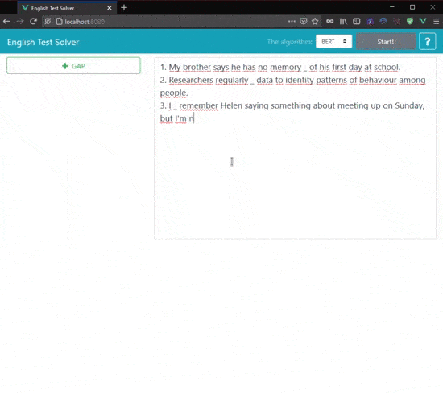

# English Test Solver

This project has a goal to create a simple app for solving tests of English knowledge using modern techniques of NLP. 

## Architecture

The app starts inside docker containers and use a browser to interact with a user.

Backend part uses DjangoRestFramework.

Frontend part uses Vue.js.

## Available test solvers

### Choose a suitable word from a given list

This task is solved using two algorithms on user's CPU: 
1. BERT-based model (`bert-base-uncased`).
2. GPT-2-based model (`gpt2`)

## Installation

1. Install Docker
2. Install Docker Compose
3. Copy or download `prepare.sh` to some empty folder (it will create some directories and download some files)
4. Run `prepare.sh` to download the smallest amount of necessary files
5. Run `docker-compose up` to start services
6. Open `http://localhost:8080/` and use!

To stop containers run `docker-compose stop`.

To remove them `docker-compose rm`.

## Demo

## Development

Look at REAMDE files of frontend and backend parts.